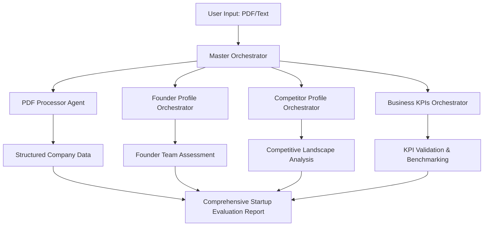

# Startup Evaluation Workflow System Documentation

## Overview

The Startup Evaluation Workflow System is a comprehensive multi-agent system designed to analyze startup pitch documents and generate in-depth evaluation reports. The system processes PDF documents through specialized orchestrators that handle different aspects of startup analysis: PDF processing, founder verification, competitive analysis, and business KPI validation.

## System Architecture



## Entry Points and Flow

### Primary Entry Point
**File**: `workflow/master/agent.py`
**Function**: `root_agent` (alias: `master_agent`)

The master orchestrator serves as the main entry point and coordinates the entire evaluation pipeline through a sequential processing approach.

### Processing Flow

#### 1. Document Input & Processing
- **Input Types**: PDF documents, structured text, mixed inputs
- **Processing**: File upload handling, session management, document validation
- **Output**: Structured company data ready for analysis

#### 2. Sequential Analysis Pipeline
The system executes four main analysis phases in sequence:

1. **PDF Processing** → 2. **Founder Verification** → 3. **Competitive Analysis** → 4. **KPI Validation**

## Orchestrator Components

### 1. Master Orchestrator
**Location**: `workflow/master/`
**Purpose**: Root coordination and session management
**Type**: Entry point orchestrator

**Key Responsibilities**:
- System initialization and session management
- File upload and document processing coordination
- Sequential pipeline execution
- Result aggregation and final report generation

**Pipeline Structure**: SequentialAgent with 4 sub-agents

### 2. PDF Processor Agent
**Location**: `agents/process_pdf/`
**Purpose**: Document content extraction and structuring
**Integration**: First stage in master pipeline

**Key Responsibilities**:
- Extract text and structured data from PDF documents
- Identify company information, founders, business model, market data
- Structure extracted data for downstream analysis
- Handle various document types (pitch decks, business plans, reports)

### 3. Founder Profile Orchestrator
**Location**: `workflow/founder_profile_orchestrator/`
**Purpose**: Founding team verification and analysis
**Specialization**: India-specific startup ecosystem

**Pipeline Structure**:
- **Verification Pipeline**: Query Generator → Data Analyst
- **Report Synthesis**: Team assessment and individual founder profiles

**Key Features**:
- Multi-source search integration (Google + Indian news)
- India-specific verification patterns and KPIs
- Comprehensive claim validation and credibility scoring

### 4. Competitor Profile Orchestrator
**Location**: `workflow/competitor_profile_orchestrator/`
**Purpose**: Competitive landscape analysis and market positioning
**Pipeline Structure**: Discovery → Analysis & Synthesis

**Processing Stages**:
- **Discovery**: Extraction → Market Research → Intelligence Gathering
- **Analysis**: Competitive Analysis → Report Synthesis

**Key Features**:
- Comprehensive competitor identification and profiling
- Market gap analysis and positioning validation
- Strategic recommendations and risk assessment

### 5. Business KPIs Orchestrator
**Location**: `workflow/business_kpis_orchestrator/`
**Purpose**: Business metrics validation and industry benchmarking
**Pipeline Structure**: Sequential + Parallel processing hybrid

**Processing Phases**:
- **Market Validation** (Sequential): Classification → Validation → Framework Selection
- **Analysis & Benchmarking** (Parallel): Industry Benchmarking || KPI Analysis
- **Report Synthesis**: Comprehensive KPI validation report

**Key Features**:
- Industry-specific KPI framework selection
- Parallel processing for performance analysis
- Comprehensive consistency checking and quality control

## Data Flow and Session Management

### Session Structure
```
sessions/user_{user_id}_{app_name}/
├── llm_response.json                    # Master response
├── llm_response.md                      # Master markdown report
├── process_pdf_agent_pdf_content.json   # PDF extraction results
├── founder_verification_results.json    # Founder analysis results
├── competitor_report_synthesis.md       # Competitive analysis report
├── business_kpi_report_synthesis.md     # KPI validation report
└── {agent}_specific_results.json        # Agent-specific outputs
```

### Data Persistence Strategy
- **Session-based**: All results stored in user-specific session directories
- **Stage Isolation**: Each orchestrator maintains independent result files
- **Format Diversity**: JSON for structured data, Markdown for reports
- **Traceability**: Complete audit trail of processing stages

## Processing Patterns

### Sequential Processing (Master Pipeline)
```python
startup_evaluation_pipeline = SequentialAgent(
    name="startup_evaluation_pipeline",
    sub_agents=[
        create_pdf_processor_agent(),
        create_founder_profile_orchestrator(),
        create_competitor_profile_orchestrator(),
        create_business_kpis_orchestrator(),
    ]
)
```

### Parallel Processing (KPI Analysis)
```python
analysis_benchmarking_pipeline = ParallelAgent(
    name="analysis_benchmarking_pipeline",
    sub_agents=[
        create_industry_benchmarking_agent_with_callback(),
        create_kpi_analysis_agent_with_callback(),
    ]
)
```

### Factory Pattern (Agent Creation)
All orchestrators use factory functions for clean instantiation:
```python
def create_{orchestrator_name}():
    # Fresh instance creation
    # Callback attachment
    # Configuration application
    # Resource isolation
```

## Configuration and Environment

### Model Configuration
```python
MODEL = config.get_model_for_agent("abc_agent")
```

### Temperature Settings
```python
generate_content_config=types.GenerateContentConfig(
    temperature=config.TEMPERATURE,
)
```

### Planning Configuration
```python
planner=PlanReActPlanner()
```

## Quality Control and Error Handling

### Error Handling Strategies
- **Retry Logic**: Automatic retry with exponential backoff
- **Fallback Strategies**: Alternative processing paths for failures
- **Graceful Degradation**: Partial results when complete processing fails
- **State Persistence**: Intermediate results preserved for debugging

### Quality Control Measures
- **Consistency Checking**: Cross-validation between parallel processing results
- **Source Credibility**: Weighted scoring based on information source quality
- **Confidence Scoring**: Evidence-based confidence metrics throughout
- **Validation Checkpoints**: Multiple verification stages for critical information

## Monitoring and Logging

### Pipeline Progress Tracking
Each orchestrator provides detailed progress logging:
```
👑 Master Agent: Starting comprehensive startup evaluation
🔄 PDF Processing: Extracting content from pitch documents
👑 Founder Profile: Starting team verification workflow
🏢 Competitor Profile: Starting competitive landscape analysis
📊 Business KPIs: Starting KPI validation and benchmarking
```

### Stage-Level Monitoring
- **Discovery Stages**: Extraction → Research → Intelligence → Analysis → Synthesis
- **Validation Stages**: Classification → Validation → Framework → Benchmarking → Analysis
- **Quality Metrics**: Consistency scores, confidence levels, source credibility

## Integration Points

### Input Flexibility
- **PDF Documents**: Direct file upload and processing
- **Structured Text**: Direct business data input
- **Mixed Inputs**: Combination of documents and structured data
- **URLs**: Web-based information sources

### Output Formats
- **Executive Summaries**: High-level findings and recommendations
- **Detailed Reports**: Comprehensive analysis with evidence
- **Structured Data**: JSON format for programmatic access
- **Markdown Reports**: Human-readable formatted reports

## Usage Patterns

### Standard Evaluation Flow
1. **Input**: User uploads startup pitch deck (PDF)
2. **Processing**: Master orchestrator initiates sequential pipeline
3. **Analysis**: Four specialized orchestrators analyze different aspects
4. **Synthesis**: Results aggregated into comprehensive evaluation
5. **Output**: Multi-format reports with recommendations

### Input Type Handling
- **PDF-Heavy**: Full pipeline with document processing
- **Text-Heavy**: Skip PDF processing, proceed to analysis
- **Mixed**: Process both components, combine insights

## Performance Considerations

### Resource Management
- **Memory Efficiency**: Large document and search result handling
- **Processing Time**: Balance between thoroughness and response time
- **API Usage**: Optimized search and analysis tool usage
- **Concurrent Processing**: Parallel execution where beneficial

### Scalability Design
- **Modular Architecture**: Independent orchestrator scaling
- **Session Isolation**: User-specific processing environments
- **Resource Cleanup**: Proper session management and cleanup
- **Pipeline Resumption**: Ability to resume from intermediate stages

## Best Practices

### For Developers
1. **Factory Pattern**: Always use factory functions for agent creation
2. **Callback Management**: Implement comprehensive progress tracking
3. **Error Resilience**: Build retry logic and fallback strategies
4. **State Management**: Persist intermediate results for debugging
5. **Resource Isolation**: Ensure clean agent instantiation

### For Users
1. **Document Quality**: Provide clear, well-structured pitch documents
2. **Information Completeness**: Include comprehensive company and founder information
3. **Context Provision**: Provide industry and market context where possible
4. **Result Review**: Carefully review confidence scores and validation results

## Future Enhancement Areas

### System Improvements
- **Async Processing**: Improved parallel processing capabilities
- **Real-time Updates**: Live progress tracking and updates
- **Enhanced Caching**: Intelligent result caching and reuse
- **Advanced Analytics**: Machine learning-enhanced analysis

### Analysis Enhancements
- **Industry Expansion**: Support for additional industry verticals
- **Geographic Expansion**: Enhanced support for global startup ecosystems
- **Temporal Analysis**: Historical trend analysis and projections
- **Network Analysis**: Enhanced founder and competitive network analysis

## Troubleshooting Guide

### Common Issues
1. **PDF Processing Failures**: Document format or corruption issues
2. **Search API Limits**: Rate limiting or quota exhaustion
3. **Pipeline Interruptions**: Network or processing failures
4. **Consistency Warnings**: Conflicting information across sources

### Resolution Strategies
1. **Document Validation**: Pre-process documents for compatibility
2. **API Management**: Implement proper rate limiting and retry logic
3. **Checkpoint Recovery**: Resume processing from last successful stage
4. **Manual Review**: Human validation for critical inconsistencies

## Conclusion

The Startup Evaluation Workflow System provides a comprehensive, multi-faceted approach to startup analysis through specialized orchestrators. The system's modular design, robust error handling, and comprehensive reporting make it suitable for investment decision support, due diligence processes, and strategic planning activities.

The sequential processing approach ensures logical dependency management, while the hybrid sequential/parallel processing patterns optimize performance and thoroughness. The India-specific customizations and multi-source verification capabilities make it particularly effective for emerging market startup evaluation.
