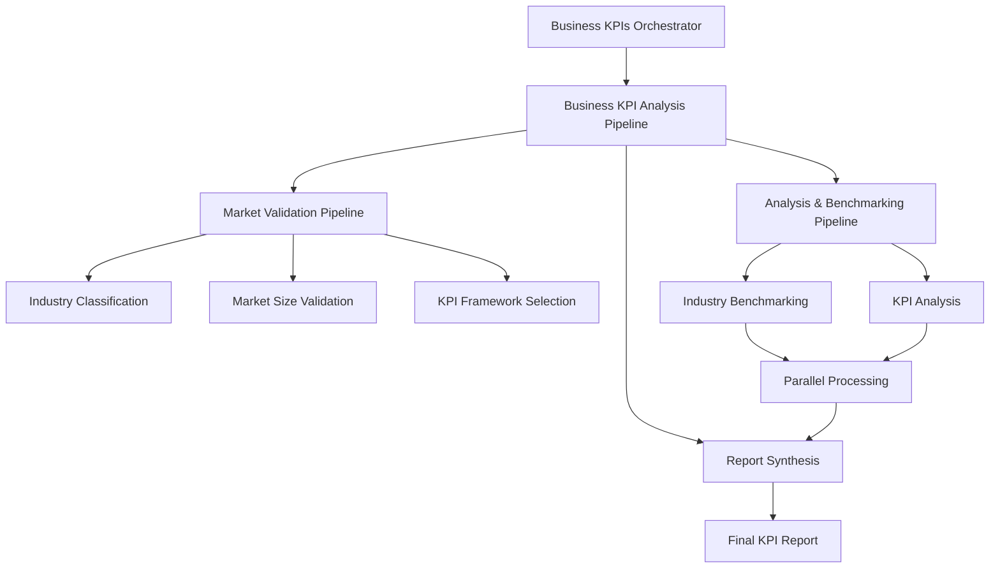

# Business KPIs Orchestrator Documentation

## Overview

The Business KPIs Orchestrator is a sophisticated multi-agent system that validates and analyzes startup business metrics against industry benchmarks and market research. It coordinates industry classification, market size validation, KPI analysis, and benchmarking through a combination of sequential and parallel processing pipelines.

## Architecture

### Entry Point
- **File**: `workflow/business_kpis_orchestrator/agent.py`
- **Main Function**: `create_business_kpis_orchestrator()`
- **Root Agent**: `business_kpis_orchestrator`
- **Model**: Configured via `config.get_model_for_agent("abc_agent")`

### System Flow



## Pipeline Architecture

The orchestrator implements a hierarchical pipeline structure with three main phases:

### Phase 1: Market Validation Pipeline (Sequential)
**Type**: SequentialAgent
**Purpose**: Foundation analysis and framework selection

1. **Industry Classification Agent**
   - Classifies startup's primary industry sector
   - Determines business model type and growth stage
   - Feeds classification data to downstream agents

2. **Market Size Validation Agent**
   - Validates TAM/SAM/SOM claims against authoritative sources
   - Searches Gartner, Forrester, McKinsey reports
   - Calculates variance percentages and flags discrepancies

3. **KPI Framework Selection Agent**
   - Selects industry-specific KPI frameworks
   - Customizes frameworks based on growth stage
   - Ensures framework completeness and relevance

### Phase 2: Analysis & Benchmarking Pipeline (Parallel)
**Type**: ParallelAgent
**Purpose**: Independent processing for performance analysis

1. **Industry Benchmarking Agent**
   - Compares startup KPIs against industry benchmarks
   - Calculates percentile rankings for each KPI
   - Identifies performance gaps and exceptional performance

2. **KPI Analysis Agent**
   - Analyzes individual KPI performance and trends
   - Generates recommendations based on performance gaps
   - Validates exceptional performance claims

### Phase 3: Report Synthesis Agent
**Type**: Agent
**Purpose**: Aggregates all analysis results into comprehensive reports

## Key Features

### Error Handling and Retry Logic
```python
MAX_RETRY_ATTEMPTS = 3
RETRY_DELAY_SECONDS = 2

def handle_pipeline_error(pipeline_name, error, callback_context, **kwargs):
    # Implements retry logic with exponential backoff
    # Stores retry counts in callback context
    # Provides fallback strategies for failed components
```

### State Management
The system uses a sophisticated context management system:

```python
def ctx_get(ctx, key, default=None):
    # Safe accessor for CallbackContext
    
def ctx_set(ctx, key, value):
    # Safe setter for CallbackContext
```

### Result Synchronization
For parallel processing, the system implements result synchronization:

```python
def synchronize_parallel_results(callback_context):
    # Cross-validates results for consistency
    # Creates synchronized result structure
    # Performs consistency checks between parallel agents
```

## Callback System

### Pipeline Progress Callbacks
- `setup_business_kpis_orchestrator_callback`: Initializes orchestrator
- `market_validation_pipeline_callback`: Tracks sequential pipeline progress
- `analysis_benchmarking_pipeline_callback`: Tracks parallel pipeline progress
- `parallel_pipeline_completion_callback`: Synchronizes parallel results

### Result Storage Callbacks
Each agent has dedicated storage callbacks:
- `_store_industry_classification`: Stores classification results
- `_store_market_validation`: Stores validation results
- `_store_kpi_framework`: Stores framework selection results
- `_store_benchmarking`: Stores benchmarking results
- `_store_kpi_analysis`: Stores analysis results

### Report Generation Callback
```python
def kpi_report_synthesis_callback(callback_context, llm_response: LlmResponse):
    # Validates required pipeline results
    # Saves response to markdown file
    # Handles missing results with warnings
```

## Data Consistency and Quality Control

### Consistency Checks
```python
def perform_result_consistency_checks(benchmarking_results, kpi_analysis_results):
    # Validates performance score alignment
    # Checks industry positioning consistency
    # Calculates recommendation overlap
    # Returns consistency score and warnings
```

### Quality Metrics
- **Overall Consistency Score**: Calculated based on cross-validation
- **Performance Score Difference**: Variance between benchmarking and KPI analysis
- **Position Consistency**: Alignment between different position indicators
- **Recommendation Overlap**: Jaccard similarity between improvement suggestions

## Industry-Specific Processing

### Supported Industries
- **SaaS/Software**: ARR, MRR, CAC, LTV, churn rate, NPS, ARPU
- **E-commerce**: GMV, conversion rates, AOV, CAC, customer retention
- **Fintech**: Transaction volume, user growth, regulatory compliance
- **Healthcare/Biotech**: Clinical progress, regulatory approvals, R&D efficiency

### Adaptive Framework Selection
The system automatically selects appropriate KPI frameworks based on:
- Industry classification results
- Business model type
- Growth stage
- Company size and maturity

## Fallback Strategies

### Parallel Processing Failures
```python
def handle_parallel_processing_failure(callback_context, failed_agents):
    fallback_strategies = {
        "industry_benchmarking": "Use generic industry benchmarks",
        "kpi_analysis": "Perform basic KPI validation"
    }
    # Applies fallback strategies and logs impact
```

## Agent Creation Pattern

The system uses a factory pattern for agent creation:

```python
def create_business_kpis_orchestrator():
    # Creates fresh instance with proper configuration
    # Applies callbacks and tools
    # Returns configured orchestrator agent
```

This pattern ensures:
- Fresh instances for each execution
- Proper callback attachment
- Consistent configuration
- Resource isolation

## Configuration

### Model Configuration
```python
MODEL = config.get_model_for_agent("abc_agent")
```

### Temperature Settings
```python
generate_content_config=types.GenerateContentConfig(
    temperature=config.TEMPERATURE,
)
```

### Planner Configuration
```python
planner=PlanReActPlanner()
```

## Input Processing Strategy

### For PDF Documents
1. Extract business data and KPIs from documents
2. Structure information for downstream agents
3. Proceed with full pipeline including document processing

### For Text Inputs
1. Parse business data directly from text
2. Skip PDF processing phase
3. Proceed directly to industry classification

### For Mixed Inputs
1. Process both text and document components
2. Combine information from multiple sources
3. Ensure comprehensive data collection

## Output Structure

The system generates comprehensive reports with:

### Executive Summary
- High-level KPI validation findings
- Overall assessment and confidence scores

### Market Size Validation Results
- TAM/SAM/SOM validation status
- Variance analysis with authoritative sources
- Confidence scores and key sources

### Industry Classification & Framework
- Primary industry classification
- Business model type and growth stage
- Selected KPI framework details

### KPI Performance Analysis
- Overall KPI score (0-10 scale)
- Industry percentile ranking
- Performance strengths and gaps
- Improvement recommendations

### Benchmarking Results
- Detailed comparison against industry benchmarks
- Percentile rankings for each KPI
- Performance context and typical ranges

### Red Flags & Opportunities
- Critical concerns with supporting evidence
- Market opportunities and competitive advantages
- Risk assessment and mitigation strategies

## Session Management

Results are persisted to session directories:
```
sessions/user_{user_id}_{app_name}/
├── business_kpi_report_synthesis.md
├── industry_classification_results.json
├── market_validation_results.json
├── kpi_framework_results.json
├── benchmarking_results.json
└── kpi_analysis_results.json
```

## Dependencies

### Internal Agents
- `agents.industry_classifier.agent`
- `agents.market_size_validator.agent`
- `agents.kpi_framework_selector.agent`
- `agents.industry_benchmarking.agent`
- `agents.kpi_analysis.agent`
- `agents.report_synthesis.agent`

### External Dependencies
- `google.adk.agents`: Agent framework
- `google.adk.models`: LLM response handling
- `google.adk.planners`: Planning capabilities
- `google.genai.types`: Generation configuration

## Monitoring and Logging

Comprehensive logging throughout the pipeline:
- Pipeline initiation and progress
- Agent execution status
- Error handling and retry attempts
- Result synchronization status
- Quality control metrics
- Final report generation

## Best Practices

1. **Error Resilience**: Implement retry logic and fallback strategies
2. **State Persistence**: Store intermediate results for debugging
3. **Quality Control**: Validate consistency between parallel results
4. **Modular Design**: Use factory pattern for agent creation
5. **Resource Management**: Ensure proper cleanup and resource isolation