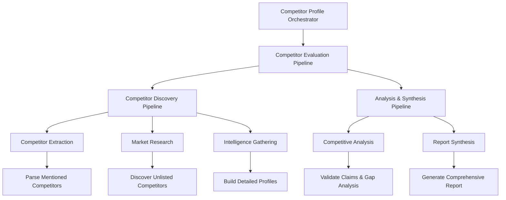

# Competitor Profile Orchestrator Documentation

## Overview

The Competitor Profile Orchestrator is a comprehensive multi-agent system that analyzes competitive landscapes and validates market positioning for startups. It coordinates competitor extraction, market research, intelligence gathering, competitive analysis, and report generation through a structured sequential pipeline.

## Architecture

### Entry Point
- **File**: `workflow/competitor_profile_orchestrator/agent.py`
- **Main Function**: `create_competitor_profile_orchestrator()`
- **Root Agent**: `competitor_profile_orchestrator`
- **Model**: Configured via `config.get_model_for_agent("abc_agent")`

### System Flow



## Pipeline Architecture

The orchestrator implements a two-tier sequential pipeline structure:

### Tier 1: Competitor Evaluation Pipeline
**Type**: SequentialAgent
**Purpose**: Main coordination pipeline

1. **Competitor Discovery Pipeline** → **Analysis & Synthesis Pipeline**

### Tier 2A: Competitor Discovery Pipeline (Sequential)
**Purpose**: Comprehensive competitor identification and profiling

1. **Competitor Extraction Agent**
   - **Function**: Parse mentioned competitors from pitch documents
   - **Output**: List of explicitly mentioned competitors and claims
   - **Stage**: 1/3 of discovery process

2. **Market Research Agent**
   - **Function**: Discover unlisted competitors through search
   - **Output**: Additional competitors found through market research
   - **Stage**: 2/3 of discovery process

3. **Intelligence Gathering Agent**
   - **Function**: Build detailed competitor profiles
   - **Output**: Comprehensive intelligence on all identified competitors
   - **Stage**: 3/3 of discovery process

### Tier 2B: Analysis & Synthesis Pipeline (Sequential)
**Purpose**: Analysis and reporting based on gathered intelligence

1. **Competitive Analysis Agent**
   - **Function**: Validate competitive advantage claims against market evidence
   - **Output**: Gap analysis and claim validation results
   - **Features**: Identifies missing competitors and validates positioning

2. **Report Synthesis Agent**
   - **Function**: Generate comprehensive competitor profile reports
   - **Output**: Final reports with confidence scores and recommendations
   - **Features**: Risk factor identification and strategic recommendations

## Key Components

### Agent Factory Functions

Each agent is created using factory functions to ensure fresh instances:

```python
def create_competitor_discovery_pipeline():
    # Creates fresh pipeline with extraction → research → intelligence

def create_analysis_synthesis_pipeline():
    # Creates fresh pipeline with analysis → synthesis

def create_competitor_evaluation_pipeline():
    # Creates main pipeline combining discovery and analysis
```

### Progress Tracking Callbacks

The system implements comprehensive progress tracking:

```python
def competitor_discovery_pipeline_callback(callback_context, **kwargs):
    # Tracks discovery pipeline progress

def competitor_extraction_progress_callback(callback_context, **kwargs):
    # Stage 1/3: Competitor Extraction progress

def market_research_progress_callback(callback_context, **kwargs):
    # Stage 2/3: Market Research progress

def intelligence_gathering_progress_callback(callback_context, **kwargs):
    # Stage 3/3: Intelligence Gathering progress
```

### Analysis Phase Callbacks

```python
def analysis_pipeline_callback(callback_context, **kwargs):
    # Tracks analysis pipeline initiation

def competitive_analysis_progress_callback(callback_context, **kwargs):
    # Analysis Stage 1/2: Competitive Analysis progress

def report_synthesis_progress_callback(callback_context, **kwargs):
    # Analysis Stage 2/2: Report Synthesis progress
```

## Processing Stages

### Stage 1: Competitor Extraction
**Purpose**: Parse mentioned competitors and claims from pitch documents

**Input**:
- Pitch deck content
- Business plan documents
- Company descriptions

**Processing**:
- Identifies explicitly mentioned competitors
- Extracts competitive advantage claims
- Categorizes competitor types (direct, indirect, substitute)

**Output**:
- List of mentioned competitors
- Competitive claims and positioning statements
- Competitor categorization data

### Stage 2: Market Research
**Purpose**: Discover competitors not mentioned in the pitch

**Input**:
- Company industry classification
- Business model information
- Market segment data

**Processing**:
- Searches market databases and reports
- Identifies industry players and emerging competitors
- Cross-references with known market leaders

**Output**:
- Additional competitor list
- Market landscape mapping
- Industry player categorization

### Stage 3: Intelligence Gathering
**Purpose**: Build comprehensive profiles for all identified competitors

**Input**:
- Complete competitor list (mentioned + discovered)
- Company basic information

**Processing**:
- Researches each competitor's business model
- Gathers financial and performance data
- Analyzes product offerings and positioning

**Output**:
- Detailed competitor profiles
- Financial and performance metrics
- Product and service comparisons

### Stage 4: Competitive Analysis
**Purpose**: Validate claims and perform gap analysis

**Input**:
- Competitor intelligence data
- Original competitive claims from pitch

**Processing**:
- Validates competitive advantage claims
- Identifies market positioning gaps
- Analyzes competitive strengths and weaknesses

**Output**:
- Claim validation results
- Gap analysis report
- Competitive positioning assessment

### Stage 5: Report Synthesis
**Purpose**: Generate comprehensive competitive analysis report

**Input**:
- All previous stage outputs
- Validation and analysis results

**Processing**:
- Synthesizes all competitive intelligence
- Generates executive summaries
- Creates strategic recommendations

**Output**:
- Comprehensive competitor profile report
- Executive summary with key findings
- Strategic recommendations and risk assessments

## Report Structure

The final competitive analysis report includes:

### Executive Summary
- Overall competitive landscape assessment
- Key competitive threats and opportunities
- Strategic positioning recommendations

### Competitor Profiles
- Detailed profiles for each identified competitor
- Financial performance comparisons
- Product and service analysis
- Market share and positioning data

### Gap Analysis
- Missing competitors identification
- Market positioning gaps
- Competitive advantage validation results

### Risk Assessment
- Competitive threats assessment
- Market entry barriers analysis
- Strategic risk factors

### Recommendations
- Competitive positioning strategies
- Market differentiation opportunities
- Investment decision support

## Session Management

Results are persisted to session directories:
```
sessions/user_{user_id}_{app_name}/
├── competitor_report_synthesis.md
├── competitor_extraction_results.json
├── market_research_results.json
├── intelligence_gathering_results.json
├── competitive_analysis_results.json
└── competitor_profiles.json
```

## Agent Integration

### Internal Agent Dependencies
- `agents.competitive_analysis.agent`: Claim validation and gap analysis
- `agents.competitor_extractor.agent`: Document parsing and extraction
- `agents.competitor_intelligence.agent`: Intelligence gathering and profiling
- `agents.market_researcher.agent`: Market research and competitor discovery
- `agents.report_synthesis.agent`: Report generation and synthesis

### Enhanced Agent Wrapping
Each base agent is wrapped with progress tracking:

```python
def create_competitive_analysis_pipeline_agent():
    # Wraps base agent with progress callbacks
    # Maintains original functionality
    # Adds progress tracking and logging

def create_report_synthesis_pipeline_agent():
    # Wraps synthesis agent with callbacks
    # Handles report generation and persistence
    # Provides status updates
```

## Configuration

### Model Configuration
```python
MODEL = config.get_model_for_agent("abc_agent")
```

### Agent Configuration
```python
generate_content_config=types.GenerateContentConfig(
    temperature=config.TEMPERATURE,
)
planner=PlanReActPlanner()
include_contents="default"
```

## Logging and Monitoring

The system provides detailed logging throughout the pipeline:

### Discovery Phase Logging
```
🔍 competitor_discovery_pipeline: Starting sequential competitor discovery process
📋 Stage 1/3: Competitor Extraction - Parsing mentioned competitors and claims
🌐 Stage 2/3: Market Research - Discovering unlisted competitors through search
🕵️ Stage 3/3: Intelligence Gathering - Building detailed competitor profiles
```

### Analysis Phase Logging
```
🔄 competitor_analysis_pipeline: Competitor analysis pipeline initiated
🔍 Analysis Stage 1/2: Competitive Analysis - Validating claims and identifying gaps
📊 Analysis Stage 2/2: Report Synthesis - Generating comprehensive competitor profile report
```

### System Logging
```
🏢 Competitor Profile Orchestrator: 🚀 Starting competitive landscape analysis workflow
🤖 founder_report_synthesizer: Synthesizing verification results from all founders
```

## Error Handling

### Pipeline Resilience
- Sequential processing with stage isolation
- Error propagation with context preservation
- Graceful degradation for partial failures

### Recovery Strategies
- Continuation from last successful stage
- Partial result utilization
- Alternative data source fallbacks

## Best Practices

1. **Stage Isolation**: Each discovery stage is independent and can recover from failures
2. **Progress Transparency**: Comprehensive logging provides clear pipeline visibility
3. **Data Quality**: Multiple validation points ensure data integrity
4. **Resource Management**: Factory pattern ensures clean agent instantiation
5. **Result Persistence**: All intermediate results are saved for debugging and analysis

## Dependencies

### External Dependencies
- `google.adk.agents`: Agent framework components
- `google.adk.models`: LLM response handling
- `google.adk.planners`: Planning capabilities
- `google.genai.types`: Generation configuration

### Utility Dependencies
- `utils.configs`: Configuration management
- `utils.helper`: Session management and file operations
- `utils.logging_config`: Logging configuration

## Usage Patterns

The orchestrator is designed to be used as part of the master evaluation pipeline:

1. **Input**: Receives startup information from PDF processing or direct input
2. **Processing**: Executes sequential discovery and analysis pipelines
3. **Output**: Generates comprehensive competitive analysis reports
4. **Integration**: Results feed into overall startup evaluation synthesis

## Scalability Considerations

- **Modular Design**: Each stage can be scaled independently
- **Resource Isolation**: Factory pattern prevents resource conflicts
- **Data Persistence**: Intermediate results enable pipeline resumption
- **Progress Tracking**: Fine-grained monitoring enables optimization
