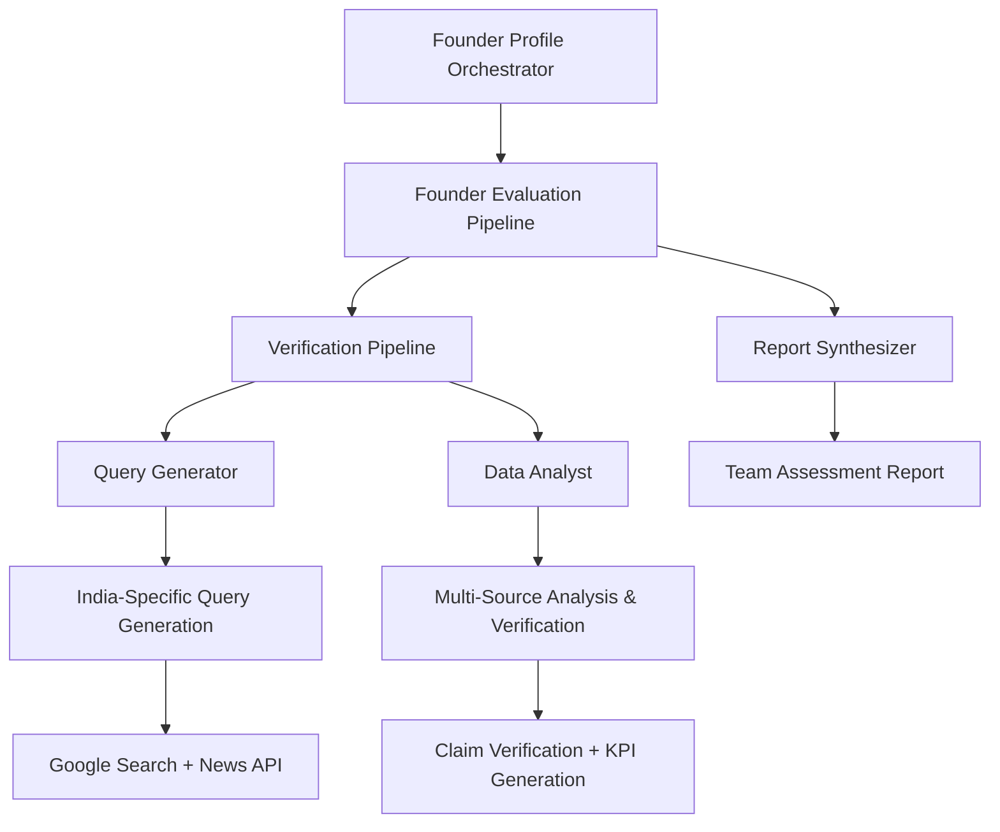

# Founder Profile Orchestrator Documentation

## Overview

The Founder Profile Orchestrator is a specialized multi-agent system designed for comprehensive founding team verification and analysis, with particular expertise in Indian startup ecosystems. It coordinates India-specific query generation, multi-source search execution, comprehensive claim verification, and team assessment reporting.

## Architecture

### Entry Point
- **File**: `workflow/founder_profile_orchestrator/agent.py`
- **Main Function**: `create_founder_profile_orchestrator()`
- **Root Agent**: `founder_profile_orchestrator`
- **Model**: Configured via `config.get_model_for_agent("abc_agent")`

### System Flow



## Pipeline Architecture

The orchestrator implements a two-tier sequential pipeline structure:

### Tier 1: Founder Evaluation Pipeline
**Type**: SequentialAgent
**Purpose**: Main coordination pipeline

1. **Verification Pipeline** → **Report Synthesizer**

### Tier 2: Verification Pipeline (Sequential)
**Purpose**: Founder claim verification and analysis

1. **Query Generator Agent**
   - **Function**: Generate targeted search queries for founder verification
   - **Specialization**: India-specific search patterns and terminology
   - **Output**: Optimized search queries for each founder

2. **Data Analyst Agent**
   - **Function**: Analyze founder claims against search evidence
   - **Specialization**: India-specific assessment patterns and KPIs
   - **Output**: Verification results and performance metrics

## Key Components

### Agent Factory Functions

Each agent is created using factory functions:

```python
def create_query_generator_agent():
    # Creates fresh query generator with India-specific focus

def create_data_analyst_agent():
    # Creates fresh data analyst with verification capabilities

def create_verification_pipeline():
    # Creates sequential query generation → data analysis pipeline

def create_founder_report_synthesizer():
    # Creates report synthesis agent with team assessment capabilities
```

### Search Tool Integration

The system integrates multiple search tools for comprehensive verification:

```python
from tools.search_tool import (
    comprehensive_founder_search,
    concise_google_search,
    search_indian_news,
)
```

#### Search Tool Distribution

**Query Generator Tools**:
- `concise_google_search`: Initial query testing and refinement
- `search_indian_news`: India-specific news source validation

**Data Analyst Tools**:
- `comprehensive_founder_search`: Deep founder background research
- `concise_google_search`: Targeted fact verification
- `search_indian_news`: News-based claim validation

## Processing Stages

### Stage 1: Query Generation
**Agent**: Query Generator
**Purpose**: Generate targeted, India-specific search queries

**Input**:
- Founder information from pitch documents
- Company context and industry data
- Claimed achievements and backgrounds

**Processing**:
- Analyzes founder claims and backgrounds
- Generates India-specific search patterns
- Creates targeted queries for different claim types
- Optimizes queries for Indian business context

**Output**:
- Structured search queries for each founder
- India-specific search patterns
- Query optimization metadata

**Tools Used**:
- `concise_google_search`: Query validation
- `search_indian_news`: News source targeting

### Stage 2: Data Analysis
**Agent**: Data Analyst
**Purpose**: Verify founder claims against comprehensive search evidence

**Input**:
- Generated search queries
- Founder claims and backgrounds
- Company and industry context

**Processing**:
- Executes comprehensive searches for each founder
- Analyzes search results against claimed achievements
- Validates educational backgrounds and work experience
- Assesses credibility and consistency of information
- Generates India-specific verification KPIs

**Output**:
- Detailed verification results for each founder
- Credibility scores and evidence quality metrics
- India-specific assessment indicators
- Risk factors and inconsistency flags

**Tools Used**:
- `comprehensive_founder_search`: Deep background research
- `concise_google_search`: Targeted verification
- `search_indian_news`: News-based validation

### Stage 3: Report Synthesis
**Agent**: Founder Report Synthesizer
**Purpose**: Generate comprehensive team assessment reports

**Input**:
- Individual founder verification results
- Credibility scores and metrics
- Risk factors and inconsistencies

**Processing**:
- Synthesizes individual founder analyses
- Generates team-level assessment metrics
- Creates executive summaries with key findings
- Develops investment decision support insights

**Output**:
- Comprehensive team assessment report
- Individual founder profiles with verification status
- Team dynamics and risk assessment
- Investment recommendations with confidence scores

## India-Specific Features

### Specialized Search Patterns
- **Educational Institutions**: IIT, IIM, and top Indian universities
- **Corporate Background**: Indian unicorns, major corporations, startups
- **News Sources**: Economic Times, LiveMint, YourStory, Inc42
- **Professional Networks**: LinkedIn India, professional associations

### Cultural Context Assessment
- **Business Networks**: Industry connections and mentorship
- **Academic Credentials**: Tier-1 institution validation
- **Professional Experience**: Indian corporate and startup ecosystem
- **Media Presence**: Coverage in Indian business media

### Verification KPIs
- **Educational Verification**: Institution attendance and degree validation
- **Professional Background**: Role and company verification
- **Achievement Validation**: Awards, recognitions, media coverage
- **Consistency Score**: Information consistency across sources
- **Credibility Rating**: Overall founder credibility assessment

## Callback System

### Setup and Progress Callbacks
```python
def setup_orchestrator_callback(callback_context, **kwargs):
    # Initializes founder verification workflow

def verification_pipeline_callback(callback_context, **kwargs):
    # Tracks verification pipeline progress

def query_generation_callback(callback_context, **kwargs):
    # Monitors query generation phase

def data_analysis_callback(callback_context, **kwargs):
    # Tracks data analysis and verification phase
```

### Report Generation Callback
```python
def synthesis_callback(callback_context, llm_response: LlmResponse):
    # Handles report synthesis completion
    # Saves results to markdown file
    # Manages session data persistence
```

## Configuration

### Model Configuration
```python
MODEL = config.get_model_for_agent("abc_agent")
```

### Agent Configuration
```python
generate_content_config=types.GenerateContentConfig(
    temperature=config.TEMPERATURE,
)
planner=PlanReActPlanner()
include_contents="default"
```

## Report Structure

The founder assessment report includes:

### Executive Summary
- Overall team assessment score
- Key strengths and risk factors
- Investment recommendation summary

### Individual Founder Profiles
For each founder:
- **Background Verification**: Education, experience, achievements
- **Credibility Score**: Evidence-based assessment (0-10 scale)
- **Consistency Rating**: Information alignment across sources
- **Risk Factors**: Identified inconsistencies or concerns
- **Strengths**: Validated achievements and qualifications

### Team Assessment
- **Team Composition Analysis**: Skill complementarity and gaps
- **Experience Distribution**: Industry and functional expertise
- **Leadership Assessment**: CEO and co-founder evaluation
- **Network Analysis**: Professional networks and connections

### India-Specific Insights
- **Educational Pedigree**: Tier-1 institution backgrounds
- **Industry Connections**: Indian business ecosystem integration
- **Media Recognition**: Coverage in Indian business media
- **Professional Networks**: Industry associations and mentorships

### Risk Assessment
- **Verification Gaps**: Unverifiable claims or information
- **Inconsistencies**: Conflicting information across sources
- **Background Concerns**: Potential red flags or issues
- **Due Diligence Recommendations**: Areas requiring further investigation

## Session Management

Results are persisted to session directories:
```
sessions/user_{user_id}_{app_name}/
├── llm_response.md              # Main synthesis report
├── founder_verification_results.json
├── query_generation_results.json
├── data_analysis_results.json
└── team_assessment_summary.json
```

## Search Strategy

### Multi-Source Verification
1. **Google Search**: General information and professional profiles
2. **Indian News Sources**: Media coverage and business recognition
3. **Professional Networks**: LinkedIn and industry-specific platforms
4. **Educational Verification**: Institution-specific searches

### Query Optimization
- **Person-Specific Queries**: Name + company combinations
- **Achievement Verification**: Award + person + institution
- **Educational Background**: Name + institution + degree
- **Professional History**: Name + company + role + dates

## Error Handling and Quality Control

### Search Result Validation
- **Source Credibility**: Weights results by source authority
- **Information Recency**: Prioritizes recent and relevant information
- **Cross-Validation**: Confirms information across multiple sources
- **Bias Detection**: Identifies potential bias in search results

### Verification Quality Metrics
- **Information Coverage**: Percentage of claims verified
- **Source Diversity**: Number of independent verification sources
- **Consistency Score**: Agreement level across sources
- **Confidence Level**: Overall verification confidence rating

## Logging and Monitoring

### Pipeline Progress Logging
```
👑 Founder Profile Orchestrator: 🚀 Starting founding team verification workflow
🔄 verification_pipeline: Founder verification pipeline initiated - processing all founders
🔍 query_generator: Generating targeted search queries for founder verification
📊 data_analyst: Analyzing founder claims against search evidence with India-specific patterns
🤖 founder_report_synthesizer: Synthesizing verification results from all founders
```

### Search Activity Logging
- Query generation and optimization
- Search execution and result quality
- Verification process and findings
- Report synthesis and completion

## Dependencies

### Internal Dependencies
- `tools.search_tool`: Multi-source search capabilities
- `utils.configs`: Configuration management
- `utils.helper`: Session management and file operations

### External Dependencies
- `google.adk.agents`: Agent framework components
- `google.adk.models`: LLM response handling
- `google.adk.planners`: Planning capabilities
- `google.adk.tools`: Tool integration framework
- `google.genai.types`: Generation configuration

## Best Practices

1. **Multi-Source Verification**: Always use multiple search sources for validation
2. **India-Specific Context**: Apply local business context and cultural understanding
3. **Progressive Verification**: Start with broad searches, narrow to specific claims
4. **Quality Over Quantity**: Focus on high-quality, credible sources
5. **Bias Awareness**: Account for potential biases in search results and sources

## Integration with Master Pipeline

The Founder Profile Orchestrator integrates as the second stage in the master evaluation pipeline:

1. **Input**: Receives founder information from PDF processing stage
2. **Processing**: Executes comprehensive founder verification workflow
3. **Output**: Provides verified founder profiles to subsequent analysis stages
4. **Continuation**: Results inform competitor analysis and KPI validation stages

## Performance Considerations

### Search Optimization
- **Query Batching**: Efficient use of search API calls
- **Result Caching**: Avoid duplicate searches for same founders
- **Rate Limiting**: Respect search API rate limits
- **Source Prioritization**: Focus on high-value sources first

### Resource Management
- **Memory Efficiency**: Manage large search result datasets
- **Processing Time**: Balance thoroughness with response time
- **API Usage**: Optimize search tool usage for cost efficiency
