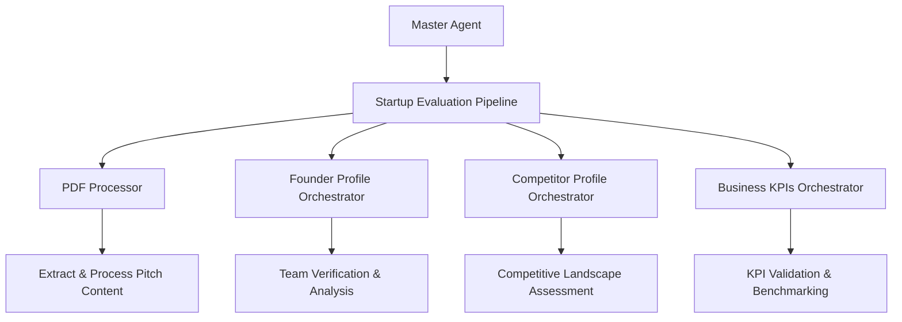

# Master Orchestrator Documentation

## Overview

The Master Orchestrator is the root entry point of the startup evaluation multi-agent system. It coordinates a comprehensive 4-phase pipeline that processes startup pitch documents and generates in-depth analysis including PDF content extraction, founder team verification, competitive landscape assessment, and market positioning reports.

## Architecture

### Entry Point
- **File**: `workflow/master/agent.py`
- **Main Agent**: `root_agent` (alias: `master_agent`)
- **Model**: Configured via `config.get_model_for_agent("abc_agent")`

### System Flow



## Pipeline Structure

The master orchestrator implements a **SequentialAgent** with the following sub-agents:

### 1. PDF Processor Agent
- **Purpose**: Extract and process pitch deck content
- **Input**: PDF documents (pitch decks, business plans)
- **Output**: Structured company data (founders, business model, market data)

### 2. Founder Profile Orchestrator
- **Purpose**: Analyze founders and generate team report
- **Input**: Founder information from PDF processing
- **Output**: Comprehensive founder verification and team assessment

### 3. Competitor Profile Orchestrator
- **Purpose**: Analyze competitors and market positioning
- **Input**: Company and market data
- **Output**: Competitive landscape analysis and positioning report

### 4. Business KPIs Orchestrator
- **Purpose**: Validate business KPIs and frameworks
- **Input**: Business metrics and market data
- **Output**: KPI validation reports with industry benchmarks

## Key Components

### Main Agent Configuration

```python
root_agent = Agent(
    model=MODEL,
    name="master_agent",
    description="Comprehensive startup evaluation system...",
    instruction=prompt.MASTER_AGENT_PROMPT,
    before_agent_callback=before_agent_callback,
    after_agent_callback=after_agent_callback,
    tools=[FunctionTool(list_user_files_py)],
    sub_agents=[startup_evaluation_pipeline],
    include_contents="default"
)
```

### Callback Functions

#### Before Agent Callback
**Function**: `before_agent_callback`
- Executes before pipeline starts
- Handles file upload logic (PDF documents)
- Creates session directories for data persistence
- Manages uploaded documents and file paths

#### After Agent Callback
**Function**: `after_agent_callback`
- Executes after pipeline completion
- Logs completion status and invocation ID
- Cleanup and finalization tasks

### Session Management

The system creates session directories for each evaluation:
```python
create_session_dir(
    session_id,
    user_id,
    app_name
)
```

Session structure:
```
sessions/
└── user_{user_id}_{app_name}/
    ├── llm_response.json
    ├── llm_response.md
    └── {agent}_results.json
```

## Core Instruction

The master agent uses a structured prompt that defines the 4-phase pipeline:

1. **PDF Processing**: Extract structured content from pitch documents
2. **Founder Verification**: Validate founder backgrounds and credibility
3. **Competitive Analysis**: Research market sizing and competitive positioning
4. **Report Generation**: Synthesize findings into actionable evaluation reports

## Tools and Utilities

### Available Tools
- `list_user_files_py`: Manages artifacts and file coordination
- `upload_tool`: Handles PDF file uploads and byte data

### File Processing
- Supports PDF documents via file path or byte data
- Automatic document validation via `check_uploaded_pdf`
- Structured data extraction for downstream agents

## Integration Points

### Input Sources
- **File Path**: Direct PDF file path processing
- **File Bytes**: Uploaded PDF document bytes
- **Structured Data**: Direct business data input

### Output Artifacts
- Session-specific result files
- Structured JSON responses
- Markdown reports
- Agent-specific analysis results

## Usage Flow

1. **Initialization**: Master agent receives startup pitch document
2. **Session Setup**: Creates session directory and processes uploads
3. **Sequential Processing**:
   - PDF extraction and content structuring
   - Founder team verification and analysis
   - Competitive landscape research and analysis
   - Business KPI validation and benchmarking
4. **Result Synthesis**: Aggregates all analysis results
5. **Report Generation**: Produces comprehensive evaluation report

## Error Handling

- Robust callback error handling
- Session-based state management
- Pipeline continuation on partial failures
- Comprehensive logging throughout the process

## Configuration

### Model Configuration
```python
MODEL = config.get_model_for_agent("abc_agent")
```

### File Paths
```python
file_path = "/Users/harish/Desktop/se-system/files/test_startup_pitch.pdf"
```

## Dependencies

### Internal Dependencies
- `agents.process_pdf.agent`: PDF processing capabilities
- `tools.file_tool`: File upload and management
- `utils.configs`: Configuration management
- `utils.helper`: Utility functions for session management
- `workflow.{*}_orchestrator`: Sub-orchestrator agents

### External Dependencies
- `google.adk.agents`: Agent framework components
- `google.adk.tools`: Tool integration framework

## Best Practices

1. **Session Management**: Always create session directories for data persistence
2. **Error Handling**: Implement robust error handling in callbacks
3. **State Management**: Use callback context for state persistence across agents
4. **Logging**: Comprehensive logging for pipeline monitoring
5. **File Processing**: Validate uploaded files before processing

## Monitoring and Logging

The system provides detailed logging at each stage:
- Before/after agent execution
- File upload and processing status
- Session creation and management
- Pipeline progress and completion

All logs include session IDs and invocation IDs for traceability.